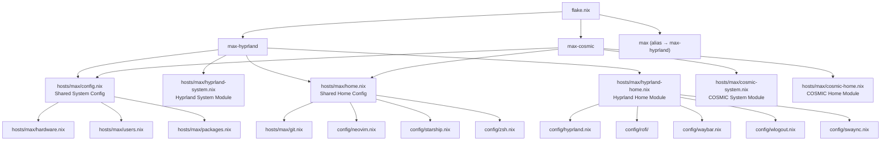

# Design Document: Multi-DE Support

## Overview

This design describes the refactoring of a NixOS flake configuration to support multiple desktop environments (DEs). The current setup has a single `nixosConfigurations."max"` entry where shared system config and Hyprland-specific config are interleaved in `hosts/max/config.nix` (system) and `hosts/max/home.nix` (home-manager). The goal is to cleanly separate shared config from DE-specific config, enabling multiple `nixosConfigurations` entries (`max-hyprland`, `max-cosmic`, and a backward-compatible `max` alias) selectable via `nixos-rebuild switch --flake .#<name>`.

The refactoring is purely structural — no new functionality is added to the Hyprland configuration. The COSMIC DE variant is new but minimal (system services + placeholder home module). The key design decision is to use a flat file layout under `hosts/max/` with clear naming conventions rather than nested directories, keeping the structure simple and consistent with the existing project style.

## Architecture

The architecture follows a composition pattern: each flake configuration is assembled from a shared base plus DE-specific modules.



### Design Decisions

1. **Flat file layout**: DE modules live alongside shared config in `hosts/max/` with a `{de}-system.nix` / `{de}-home.nix` naming convention. This avoids unnecessary directory nesting for what are just 2 files per DE.

2. **Composition in flake.nix**: Each `nixosConfigurations` entry explicitly lists its modules. No custom NixOS option abstraction or `mkIf`/`mkOption` machinery — just straightforward module imports. This keeps things transparent and easy to debug.

3. **Shared config stays in place**: `hosts/max/config.nix` and `hosts/max/home.nix` remain the shared config files (with DE-specific bits extracted out). This minimizes diff noise and preserves git history.

4. **Backward-compatible alias**: `nixosConfigurations."max"` is set to the same value as `nixosConfigurations."max-hyprland"` so existing `--flake .#max` commands keep working.

5. **Helper function in flake.nix**: A `mkHost` helper function reduces duplication when defining multiple configurations that share the same `specialArgs`, home-manager setup, and shared modules.

## Components and Interfaces

### File Inventory (after refactoring)

| File | Role | Changes |
|------|------|---------|
| `flake.nix` | Defines `nixosConfigurations` | Add `max-hyprland`, `max-cosmic`, alias `max`; add `mkHost` helper |
| `hosts/max/config.nix` | Shared system config | Remove Hyprland-specific: `programs.hyprland`, greetd hyprland cmd, portal hyprland pkg, PAM swaylock, cachix hyprland, `NIXOS_OZONE_WL` |
| `hosts/max/home.nix` | Shared home-manager config | Remove Hyprland-specific imports (hyprland.nix, rofi, swaync, waybar, wlogout), hypridle, swaylock, list-hypr-bindings, wlogout icons |
| `hosts/max/hyprland-system.nix` | **NEW** — Hyprland system module | Contains all Hyprland-specific system config extracted from config.nix |
| `hosts/max/hyprland-home.nix` | **NEW** — Hyprland home module | Contains all Hyprland-specific home config extracted from home.nix |
| `hosts/max/cosmic-system.nix` | **NEW** — COSMIC system module | `services.desktopManager.cosmic`, `cosmic-greeter`, `system76-scheduler` |
| `hosts/max/cosmic-home.nix` | **NEW** — COSMIC home module | Placeholder, empty config body |
| All other files | Unchanged | `hardware.nix`, `users.nix`, `packages.nix`, `git.nix`, `config/*` |

### Module Interfaces

Each DE module is a standard NixOS/home-manager module — a function taking `{ pkgs, ... }` (or similar) and returning an attribute set. No custom options or interfaces are needed. The composition happens purely at the flake level.

**`mkHost` helper** (in `flake.nix`):
```nix
mkHost = { systemModules, homeModules }: nixpkgs.lib.nixosSystem {
  specialArgs = { inherit system inputs username host; };
  modules = [
    ./hosts/${host}/config.nix        # shared system
  ] ++ systemModules ++ [
    home-manager.nixosModules.home-manager
    {
      home-manager.extraSpecialArgs = { inherit username inputs host; };
      home-manager.useGlobalPkgs = true;
      home-manager.useUserPackages = true;
      home-manager.backupFileExtension = "backup";
      home-manager.users.${username} = { imports = [
        ./hosts/${host}/home.nix       # shared home
      ] ++ homeModules; };
    }
  ];
};
```

Usage:
```nix
nixosConfigurations = {
  "max-hyprland" = mkHost {
    systemModules = [ ./hosts/max/hyprland-system.nix ];
    homeModules   = [ ./hosts/max/hyprland-home.nix ];
  };
  "max-cosmic" = mkHost {
    systemModules = [ ./hosts/max/cosmic-system.nix ];
    homeModules   = [ ./hosts/max/cosmic-home.nix ];
  };
  "max" = nixosConfigurations."max-hyprland";  # backward compat alias
};
```


### Extraction Details

**From `hosts/max/config.nix` → `hosts/max/hyprland-system.nix`:**

The following blocks move to the Hyprland system module:
- `programs.hyprland = { enable = true; withUWSM = true; }`
- `environment.sessionVariables.NIXOS_OZONE_WL = "1"`
- `services.greetd` block (tuigreet + `uwsm start hyprland.desktop`)
- `xdg.portal.configPackages` entry for `xdg-desktop-portal-hyprland`
- `security.pam.services.swaylock` and `security.pam.services.swaylock.fprintAuth`
- `nix.settings.substituters` hyprland cachix entry and `nix.settings.trusted-public-keys` hyprland key

The shared `config.nix` retains everything else: boot, networking, locale, fonts, hardware, security (polkit, rtkit), virtualization, pipewire, printing, bluetooth, flatpak, openssh, auto-cpufreq, etc. The `xdg.portal` block stays in shared config but without the hyprland-specific `configPackages` entry.

**From `hosts/max/home.nix` → `hosts/max/hyprland-home.nix`:**

The following move to the Hyprland home module:
- Imports: `config/hyprland.nix`, `config/rofi/rofi.nix`, `config/rofi/config-long.nix`, `config/swaync.nix`, `config/waybar.nix`, `config/wlogout.nix`
- `services.hypridle` block
- `programs.swaylock` block
- `home.file.".config/wlogout/icons"` block
- `list-hypr-bindings` script from `home.packages`

The shared `home.nix` retains: neovim, starship, zsh, git, kitty, GTK/Qt theming, cursor, XDG dirs, dconf, btop, direnv, gh, ghostty config, swappy config, wallpapers, and all non-Hyprland scripts/packages.

## Data Models

This refactoring does not introduce new data models. The "data" is NixOS module attribute sets, which are standard Nix expressions. The key structural elements are:

- **NixOS Module**: `{ pkgs, config, ... }: { <system-config-attrs> }` — used for system-level DE modules
- **Home-Manager Module**: `{ pkgs, config, ... }: { <home-config-attrs> }` — used for user-level DE modules
- **Flake Configuration**: `nixpkgs.lib.nixosSystem { modules = [...]; specialArgs = {...}; }` — the composition point

No databases, APIs, or serialization formats are involved. The "schema" is the NixOS/home-manager option type system, which is already defined by upstream modules.

## Correctness Properties

*A property is a characteristic or behavior that should hold true across all valid executions of a system — essentially, a formal statement about what the system should do. Properties serve as the bridge between human-readable specifications and machine-verifiable correctness guarantees.*

Since this is a NixOS configuration refactoring (not a traditional software application), "execution" means "Nix evaluation of the flake." Properties are verified by evaluating the flake's `nixosConfigurations` and inspecting the resulting attribute sets. Property-based testing here means generating sets of attribute paths and checking invariants across them.

### Property 1: Shared config excludes all DE-specific attributes

*For any* attribute path known to be Hyprland-specific (e.g., `programs.hyprland`, `services.greetd` with hyprland command, `security.pam.services.swaylock`, hyprland cachix substituter, `environment.sessionVariables.NIXOS_OZONE_WL`, hyprland home imports, `services.hypridle`, `programs.swaylock`), evaluating the shared system config (`config.nix`) or shared home config (`home.nix`) in isolation SHALL NOT set that attribute.

**Validates: Requirements 1.3, 4.2**

### Property 2: Shared configuration is identical across DE variants

*For any* attribute path that belongs to the shared configuration (boot, networking, locale, fonts, hardware, security/polkit, virtualization, pipewire, printing, bluetooth, flatpak, openssh, nix gc, neovim, starship, zsh, git, kitty, GTK/Qt theming, cursor, XDG dirs, dconf, btop, direnv, gh, ghostty, swappy, wallpapers), evaluating `max-hyprland` and `max-cosmic` SHALL produce identical values for that path.

**Validates: Requirements 1.4, 4.3**

### Property 3: Backward compatibility — refactored Hyprland config equivalence

*For any* attribute path present in the current (pre-refactoring) `max` configuration, the refactored `max-hyprland` configuration SHALL produce an identical value for that path. This ensures the refactoring is purely structural with no behavioral change.

**Validates: Requirements 8.1**

## Error Handling

This refactoring has a narrow error surface since it's restructuring existing, working Nix configuration:

1. **Nix evaluation errors**: If a module has a missing import, undefined variable, or type mismatch, `nix eval` or `nixos-rebuild` will fail with a clear error pointing to the offending file and line. No special error handling is needed — Nix's type system and module system catch these at evaluation time.

2. **Missing module files**: If `flake.nix` references a module path that doesn't exist (e.g., `./hosts/max/hyprland-system.nix`), Nix will fail with a "file not found" error. This is caught immediately on any build attempt.

3. **Duplicate attribute definitions**: If the same attribute is set in both the shared config and a DE module (e.g., `programs.hyprland` left in `config.nix` AND set in `hyprland-system.nix`), NixOS will error with "The option ... is defined in multiple places" unless `mkForce` or `mkMerge` is used. This is desirable — it catches extraction mistakes.

4. **COSMIC input missing**: The COSMIC DE requires the `nixos-cosmic` flake input. If this input is not added to `flake.nix`, the COSMIC module's references to COSMIC packages/options will fail at evaluation time. The design requires adding this input.

5. **Backward compatibility breakage**: The `max` alias must reference `max-hyprland` using Nix's `self` or `let` binding. If done incorrectly (e.g., infinite recursion), Nix will report the recursion. The recommended pattern is using a `let` binding.

## Testing Strategy

### Approach

Testing a NixOS flake refactoring is different from testing application code. The primary validation is that the flake evaluates successfully and produces the expected configuration. There are two levels:

1. **Nix evaluation tests** (fast, no build required): Use `nix eval` to inspect attribute paths in the evaluated configuration and verify correctness.
2. **NixOS build tests** (slow, full system closure): Use `nix build .#nixosConfigurations.<name>.config.system.build.toplevel` to verify the full system builds.

### Unit Tests (Example-Based)

These verify specific concrete values in the evaluated configurations. They can be implemented as a Nix expression that evaluates the flake and asserts attribute values, or as a shell script using `nix eval`.

**Flake structure tests:**
- `nix eval .#nixosConfigurations.max-hyprland` evaluates without error (validates 7.1, 7.4)
- `nix eval .#nixosConfigurations.max-cosmic` evaluates without error (validates 7.2, 7.5)
- `nix eval .#nixosConfigurations.max` evaluates without error (validates 8.2)
- `nix eval .#devShells.x86_64-linux.default` evaluates without error (validates 7.3)

**Hyprland system module tests:**
- `config.programs.hyprland.enable == true` in max-hyprland (validates 2.1)
- `config.programs.hyprland.withUWSM == true` in max-hyprland (validates 2.1)
- `config.services.greetd.enable == true` in max-hyprland (validates 2.2)
- greetd command contains "uwsm start hyprland.desktop" (validates 2.2)
- `config.environment.sessionVariables.NIXOS_OZONE_WL == "1"` in max-hyprland (validates 2.6)
- PAM swaylock service exists in max-hyprland (validates 2.4)
- Hyprland cachix substituter present in max-hyprland nix.settings (validates 2.5)

**COSMIC system module tests:**
- `config.services.desktopManager.cosmic.enable == true` in max-cosmic (validates 3.1)
- `config.services.displayManager.cosmic-greeter.enable == true` in max-cosmic (validates 3.2)

**Hyprland home module tests:**
- hypridle service configured in max-hyprland home (validates 5.2)
- swaylock program configured in max-hyprland home (validates 5.3)
- wlogout icons in home.file in max-hyprland home (validates 5.5)

**COSMIC home module tests:**
- COSMIC home module imports without error (validates 6.1)

### Property-Based Tests

Property-based testing for Nix configuration uses generated sets of attribute paths to verify invariants. The testing library is **pytest with Hypothesis** (Python), which can shell out to `nix eval` to inspect attribute values. Alternatively, a pure Nix test expression can iterate over lists of paths.

The recommended approach is a Nix test file (`tests/check-config.nix`) that:
1. Evaluates both configurations
2. Iterates over lists of attribute paths
3. Asserts the properties

Each property test should run with at minimum 100 attribute path samples.

- **Feature: multi-de-support, Property 1: Shared config excludes all DE-specific attributes** — Generate/enumerate Hyprland-specific attribute paths, verify none are set in the shared config evaluation.
- **Feature: multi-de-support, Property 2: Shared configuration is identical across DE variants** — Generate/enumerate shared attribute paths, evaluate both `max-hyprland` and `max-cosmic`, assert equality.
- **Feature: multi-de-support, Property 3: Backward compatibility — refactored Hyprland config equivalence** — Enumerate attribute paths from the pre-refactoring config, compare with post-refactoring `max-hyprland` values.

### Practical Testing Workflow

Given the nature of NixOS configuration, the most practical testing approach is:

1. **Pre-refactoring snapshot**: Before making changes, capture key attribute values from the current `max` config using `nix eval`.
2. **Post-refactoring verification**: After refactoring, run the same evaluations on `max-hyprland` and compare.
3. **Cross-variant comparison**: Evaluate shared paths on both `max-hyprland` and `max-cosmic` to verify shared config consistency.
4. **Full build test**: `nix build .#nixosConfigurations.max-hyprland.config.system.build.toplevel` and same for `max-cosmic` to verify the full system closure builds.
