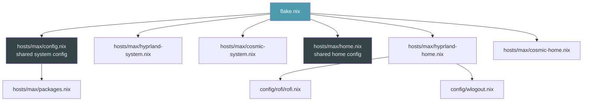

# Design Document: NixOS Config Modernization

## Overview

This design covers the modernization of a NixOS flake-based configuration for host `max`. The changes are a set of independent, low-risk package replacements, configuration simplifications, and cleanup tasks. Each change targets a specific module file and can be applied and tested in isolation via `nixos-rebuild build --flake .#max`.

The changes fall into three categories:

1. **Package swaps** — Replace deprecated/X11 packages with current Wayland-native or maintained alternatives (rofi → rofi-wayland, nixfmt → nixfmt-rfc-style, arc-theme → adw-gtk3-dark, swaylock → hyprlock)
2. **Configuration cleanup** — Remove unnecessary cachix config, simplify AppImage binfmt registration, conditionally drop the nixos-cosmic flake input
3. **Formatting normalization** — Run nixfmt-rfc-style across all `.nix` files for consistent style

No new modules, services, or flake inputs are introduced. The flake output structure (`mkHost`, `nixosConfigurations`) remains unchanged.

## Architecture

The existing architecture is a single-host NixOS flake with two desktop environment configurations composed via `mkHost`:



All changes are leaf-level edits within existing modules. No structural changes to the module tree or flake composition.

### Change Map

| Requirement | File(s) Modified | Change Type |
|---|---|---|
| R1: rofi-wayland | `config/rofi/rofi.nix` | Package swap |
| R2: Remove cachix | `hosts/max/hyprland-system.nix` | Config removal |
| R3: nixfmt-rfc-style | `hosts/max/packages.nix` | Package swap |
| R4: hyprlock | `hosts/max/hyprland-home.nix`, `config/wlogout.nix`, `hosts/max/hyprland-system.nix` | Package swap + config rewrite |
| R5: COSMIC flake | `flake.nix` (conditional) | Input removal |
| R6: adw-gtk3-dark | `hosts/max/home.nix` | Package swap |
| R7: AppImage binfmt | `hosts/max/config.nix` | Config simplification |
| R8: Formatting | All `.nix` files | Formatting pass |

## Components and Interfaces

Each change is scoped to existing NixOS/Home Manager module interfaces. No new modules or options are introduced.

### R1: Rofi Package Swap (`config/rofi/rofi.nix`)

**Current:** `package = pkgs.rofi;`
**Target:** `package = pkgs.rofi-wayland;`

The `programs.rofi.package` option accepts any rofi-compatible package. `rofi-wayland` is a drop-in replacement that provides the same binary interface with Wayland backend support. All `extraConfig`, theme, and keybinding settings are package-agnostic and remain unchanged.

### R2: Cachix Removal (`hosts/max/hyprland-system.nix`)

**Current:** `nix.settings.substituters` and `nix.settings.trusted-public-keys` contain Hyprland cachix entries.
**Target:** Remove the entire `nix.settings` block from this module. The shared `config.nix` already sets `nix.settings` for experimental features and auto-optimise.

All other config in this module (greetd, portal, session variables, PAM) is retained.

### R3: Formatter Swap (`hosts/max/packages.nix`)

**Current:** `nixfmt` in the packages list.
**Target:** Replace with `nixfmt-rfc-style`. This is a direct name substitution in the `with pkgs;` list.

### R4: Swaylock → Hyprlock (multi-file)

This is the most involved change, touching three files:

**`hosts/max/hyprland-home.nix`:**
- Remove `programs.swaylock` block entirely
- Add `programs.hyprlock.enable = true` with settings that translate the existing color scheme
- Update `services.hypridle.settings.general.lock_cmd` from `"swaylock"` to `"hyprlock"`
- Update `services.hypridle.settings.listener[0].on-timeout` from `"swaylock"` to `"hyprlock"`
- Enable fingerprint auth via `programs.hyprlock.settings.auth.fingerprint.enabled = true`

**Color scheme translation:**
The swaylock config uses these key colors:
- Background: `2f302f`
- Ring: `4b9bac`
- Key highlight: `6998b4`
- Text: `e9eaeb`

Hyprlock uses a different configuration format (Hyprland config syntax via Home Manager). The colors map to:

```nix
programs.hyprlock = {
  enable = true;
  settings = {
    general = {
      hide_cursor = true;
    };
    auth = {
      fingerprint.enabled = true;
    };
    background = [{
      color = "rgb(2f302f)";
    }];
    input-field = [{
      size = "200, 50";
      outline_thickness = 3;
      outer_color = "rgb(4b9bac)";
      inner_color = "rgb(2f302f)";
      font_color = "rgb(e9eaeb)";
      check_color = "rgb(6998b4)";
      fail_color = "rgb(4e9ba7)";
      placeholder_text = "";
    }];
  };
};
```

**`config/wlogout.nix`:**
- Replace `swaylock` with `hyprlock` in suspend, lock, and hibernate actions

**`hosts/max/hyprland-system.nix`:**
- Remove `security.pam.services.swaylock.fprintAuth = true` (hyprlock handles PAM differently — it uses the `hyprlock` PAM service automatically)

### R5: COSMIC Flake Evaluation (conditional)

This requires checking whether `services.desktopManager.cosmic.enable` is available in the current nixpkgs-unstable without the external flake. The approach:

1. Check if the option exists in nixpkgs by evaluating `nix eval`
2. If available: remove `nixos-cosmic` input from `flake.nix`, remove `nixos-cosmic.nixosModules.default` from `max-cosmic` system modules, remove `nixos-cosmic` from the outputs function signature
3. If not available: no changes

Since COSMIC was merged into nixpkgs-unstable relatively recently, this is a conditional change. The design should handle both outcomes.

### R6: GTK Theme Swap (`hosts/max/home.nix`)

**Current:**
```nix
gtk.theme = { name = "Arc-Dark"; package = pkgs.arc-theme; };
# Also in home.packages: pkgs.arc-theme
```

**Target:**
```nix
gtk.theme = { name = "adw-gtk3-dark"; package = pkgs.adw-gtk3; };
# Remove pkgs.arc-theme from home.packages
```

The existing `gtk3.extraConfig` and `gtk4.extraConfig` with `gtk-application-prefer-dark-theme = 1` are retained to ensure dark theme preference propagates. The `dconf.settings` for `color-scheme = "prefer-dark"` also remains.

### R7: AppImage Binfmt Simplification (`hosts/max/config.nix`)

**Current:** Manual `boot.binfmt.registrations.appimage` block with explicit magic bytes, mask, and interpreter.
**Target:** `programs.appimage.binfmt = true;`

This built-in NixOS option provides the same binfmt registration with upstream-maintained magic bytes. The `appimage-run` package in `packages.nix` can remain as it may be used directly.

### R8: Formatting Pass

Run `nixfmt-rfc-style` on all `.nix` files in the repository. This is a mechanical transformation that does not alter evaluation semantics. Files affected:
- `flake.nix`
- All files in `hosts/max/`
- All files in `config/`
- All files in `scripts/`

This should be the final step after all other changes are applied, so the formatting covers the new code as well.

## Data Models

No new data models are introduced. All changes operate on existing NixOS module option types:

- `programs.rofi.package`: `types.package`
- `programs.hyprlock.enable`: `types.bool`
- `programs.hyprlock.settings`: `types.attrs` (Hyprland config format)
- `programs.appimage.binfmt`: `types.bool`
- `gtk.theme.name`: `types.str`
- `gtk.theme.package`: `types.package`
- `nix.settings.substituters`: `types.listOf types.str`
- `environment.systemPackages`: `types.listOf types.package`

The swaylock-to-hyprlock migration involves a structural change in how lock screen colors are specified (swaylock uses flat key-value pairs; hyprlock uses nested sections with `background`, `input-field`, etc.), but this is a configuration format difference, not a data model change.

## Correctness Properties

*A property is a characteristic or behavior that should hold true across all valid executions of a system — essentially, a formal statement about what the system should do. Properties serve as the bridge between human-readable specifications and machine-verifiable correctness guarantees.*

Most requirements in this spec are concrete, single-valued configuration changes (set this option to this value, remove that block). These are best verified as specific examples rather than universally quantified properties. Two requirements do yield genuine properties:

### Property 1: Wlogout actions reference hyprlock exclusively

*For any* wlogout layout entry whose action previously invoked `swaylock`, the action string shall now invoke `hyprlock` instead, and no wlogout layout entry shall contain the string `swaylock`.

**Validates: Requirements 4.6**

### Property 2: Formatting idempotence

*For any* `.nix` file in the repository, running `nixfmt-rfc-style` on the file shall produce output identical to the input (i.e., the formatting operation is idempotent after the initial pass).

**Validates: Requirements 8.1**

## Error Handling

These changes are declarative NixOS module edits. Errors surface at two points:

### Evaluation-Time Errors

- **Missing package:** If `pkgs.rofi-wayland`, `pkgs.nixfmt-rfc-style`, `pkgs.adw-gtk3`, or `pkgs.hyprlock` are not available in the pinned nixpkgs, `nixos-rebuild build` will fail with an "attribute not found" error. All four packages are present in nixpkgs-unstable as of current HEAD.
- **Unknown option:** If `programs.hyprlock` or `programs.appimage.binfmt` options don't exist in the Home Manager / NixOS version, evaluation fails. Both are available in current home-manager and nixpkgs-unstable respectively.
- **COSMIC conditional (R5):** If `services.desktopManager.cosmic.enable` is not in nixpkgs without the external flake, the nixos-cosmic input must be retained. Removing it prematurely causes an evaluation error on the `max-cosmic` configuration. The implementation must check availability before removing.

### Runtime Errors

- **Hyprlock PAM:** Hyprlock uses its own PAM service (`hyprlock`). If `security.pam.services.hyprlock` is not configured (it's auto-configured when `programs.hyprland.enable = true` on recent NixOS), fingerprint auth may not work. Verify with `nixos-rebuild test`.
- **Rofi Wayland:** If rofi-wayland has different plugin compatibility, some rofi scripts may need adjustment. The current config uses only built-in modi (drun, filebrowser, run), so this is low risk.

### Mitigation

All changes can be validated with `nixos-rebuild build --flake .#max` (evaluation + build without activation) and `nixos-rebuild build --flake .#max-cosmic` for the COSMIC config. Runtime verification requires `nixos-rebuild test` on the target machine.

## Testing Strategy

### Verification Approach

Since this is a declarative NixOS configuration (not application code), the primary testing mechanism is:

1. **Nix evaluation tests** — Verify that the configuration evaluates without errors and produces the expected option values
2. **File content assertions** — Verify that specific strings are present/absent in the modified `.nix` files
3. **Build verification** — `nixos-rebuild build` confirms the full system closure builds successfully

### Unit Tests (Example-Based)

Unit tests verify specific configuration values after each change. These are implemented as Nix evaluation checks or simple grep-based assertions on file content:

| Test | Validates | Method |
|---|---|---|
| rofi package is rofi-wayland | R1.1 | grep `pkgs.rofi-wayland` in `config/rofi/rofi.nix` |
| rofi extraConfig unchanged | R1.2 | Diff extraConfig block before/after |
| No cachix substituters in hyprland-system | R2.1, R2.2 | grep absence of `hyprland.cachix.org` |
| greetd config retained | R2.3 | grep `services.greetd` present |
| nixfmt-rfc-style in packages, nixfmt absent | R3.1, R3.2 | grep packages.nix |
| hyprlock enabled | R4.1 | grep `programs.hyprlock` |
| Color values present in hyprlock config | R4.2 | grep for `2f302f`, `4b9bac`, `6998b4`, `e9eaeb` |
| No swaylock config | R4.3 | grep absence of `programs.swaylock` |
| hypridle lock_cmd is hyprlock | R4.4, R4.5 | grep `lock_cmd` and `on-timeout` values |
| No PAM swaylock | R4.7 | grep absence of `pam.services.swaylock` |
| Fingerprint enabled | R4.8 | grep `fingerprint` in hyprlock settings |
| GTK theme is adw-gtk3-dark | R6.1 | grep `adw-gtk3-dark` |
| No arc-theme references | R6.2 | grep absence of `arc-theme` |
| Dark theme preference retained | R6.3 | grep `gtk-application-prefer-dark-theme` |
| programs.appimage.binfmt = true | R7.1 | grep in config.nix |
| No manual binfmt block | R7.2 | grep absence of `binfmt.registrations.appimage` |

### Property Tests

Property tests verify universal properties across generated inputs:

- **Property 1 (Wlogout actions):** Parse the wlogout layout list and assert that no entry's `action` field contains the string `swaylock`. This can be tested by iterating all layout entries programmatically.
  - Tag: **Feature: nixos-config-modernization, Property 1: Wlogout actions reference hyprlock exclusively**

- **Property 2 (Formatting idempotence):** For each `.nix` file, run `nixfmt-rfc-style` and assert the output equals the input. This is naturally a property over the set of all `.nix` files.
  - Tag: **Feature: nixos-config-modernization, Property 2: Formatting idempotence**

### Build Verification

The definitive test is a successful build of both configurations:

```bash
nixos-rebuild build --flake .#max-hyprland
nixos-rebuild build --flake .#max-cosmic
```

This validates that all module options are correctly typed, all referenced packages exist, and the full system closure is buildable. Runtime behavior (rofi rendering, hyprlock locking, fingerprint auth) requires manual testing on the target machine with `nixos-rebuild test`.

### Test Execution Order

1. Apply all code changes (R1–R7)
2. Run unit tests / file content assertions
3. Run `nixfmt-rfc-style` formatting pass (R8)
4. Run property test for formatting idempotence
5. Run `nixos-rebuild build` for both configurations
6. Deploy with `nixos-rebuild test` for runtime verification
